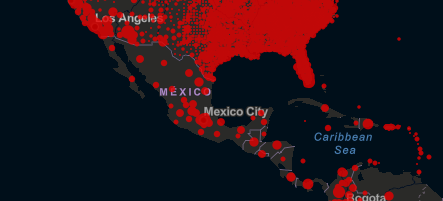

```{r setup, include=FALSE}
knitr::opts_chunk$set(echo = TRUE)
```

PARTE 1

1.- Investiga, ¿Cuál es la situación actual de COVID-19 a nivel mundial, en México, en tu estado de origen y en tu municipio, alcaldía o colonia? Puedes iniciar tu búsqueda en el sitio de Johns Hopkins

El mundo se encuentra envuelto en una crisis epidémica a causa de una nueva enfermedad llamada COVID-19, la cual es causada por el virus SARS-CoV-2 que pertenece a la familia de coronavirus y se originó en Wuhan. Dicha enfermedad se ha propagado gracias a la fácil transmisión del virus y a su tiempo de incubación que va de 1 a 14 días, esto quiere decir que desde que una persona es infectada pueden pasar hasta 14 días hasta que muestre síntomas. 

Los coronavirus son una familia de virus que afectan tanto a humanos como a animales, en los humanos estos pueden llegar a provocar infecciones respiratorias cuya gravedad puede ser tan baja como la de un resfriado común o tan grave como la de síndrome respiratorio de Oriente Medio y el síndrome respiratorio agudo severo. El nuevo coronavirus descubierto en Wuhan se transmite a través de las gotículas de la nariz o la boca que son expulsadas cuando una persona infectada estornuda o tose, cuando alguien inhala estas gotículas o toca las superficies donde estas puedan haberse esparcido y luego toca su boca.

Actualmente, el desarrollo de múltiples vacunas ha mitigado el daño que el coronavirus ha generado desde que estas comenzaron a aplicarse, sin embargo, la situación sigue siendo crítica. El impacto de esta pandemia ha sido tan fuerte que de acuerdo al instituto Jonhs Hopkins, hay 141, 716, 848 casos confirmados hasta este momento y 3, 024, 529 muertos en el mundo, siendo el 10 de Diciembre del 2020 el día en el que se registraron más casos nuevos y el 22 de Enero del 2021 fue el día en el que se registraron más muertes.

{height="500px"}
En México, de acuerdo al instituto Johns Hopkins, hay 2, 305 , 602 casos confirmados y 212, 339 muertos, siendo el 5 de Octubre del 2020 el día en el que se registraron más casos nuevos y el 5 de Febrero del 2021 fue el día en el que se registraron más muertes.

{height="500px"}
Es importante destacar que de acuerdo al instituto  Johns Hopkins, México tiene un ratio de caso-fatalidad mayor al de otros países, esto se debe a la saturación de hospitales y servicios gracias a esta pandemia, lo que ha provocado que muchos pacientes no sean atendidos y mueran, en la siguiente figura obtenida de este mismo instituto, solamente con apreciar el mapa se puede llegar a la conclusión de que méxico destaca en este ámbito.

{height="500px"}
Como se puede visualizar en los recursos gráficos anteriores, México es un país en el que si una persona se enferme de COVID-19, es más probable que muera a comparación de otros países. Querétaro, es el noveno estado con más casos acumulados en México y de acuerdo a la información pública provista por el gobierno de Querétaro hay 64, 817  casos confirmados, 955 casos activos y 4, 514 defunciones. En este estado, el municipio de Querétaro es responsable por el 70% de los casos confirmados en esta entidad, pues cuenta con 45, 387 de los 64, 817 registrados en Querétaro.


2.- ¿Cuál fue la primera variante del virus que se propagó a todo el mundo?

A finales de enero del 2020 surgió una nueva variante del SARS-CoV-2 con la diferencia de que tenía una sustitución D614G en el gen encargado de la proteína S, que se encargaba de anclar al virus a las células. Gracias a esta mutación esta nueva variante se hizo lo suficientemente infecciosa como para sustituir al virus que había aparecido originalmente en China y para junio del 2020 se convirtió en la variante predominante en todo el mundo. Por este cambio en el spike de esta variante se le denomina D614G. (WHO, 2020)


3.- ¿Cuáles son las otras variantes del virus que existen en otras regiones del mundo?

Dinamarca
Se identificó en Jutlandia del Norte, Dinamarca, en agosto y septiembre de 2020 una variante del SARS-CoV-2, cuya transmisión se daba por los animales de granja en específico los visones de granja, que posteriormente pasó a ser transmitida al ser humano. Esta variante fue denominada como “cluster 5”, por las autoridades danesas, dicha variante presenta una combinación poco antes vista de mutaciones lo que ha incrementado la preocupación de las autoridades de este país, ya que los estudios preliminares sugieren que la neutralización de dicha variante se ve comprometida en seres humanos, lo cual limitaría el alcance y la duración de la protección inmunológica tras la infección natural o la vacunación. Las autoridades danesas han registrado 12 casos humanos que se remontan desde septiembre 2020 a la variante cluster 5.

Reino Unido
En noviembre de 2020 las autoridades del reino unido notificaron a las autoridades de salud mundial (OMS) que se había identificado una variante del SARS COV 2, la cual fue denominada como  SARS-CoV-2 VOC 202012/01, dicho nombre nace por sus siglas en inglés “variante en investigación, año 2020, mes 12, variante 01”, la cual no estaba relacionada filogenéticamente con el SARS-CoV-2 que se encontraba presente en ese momento en el país, al igual que esta variante presenta 23 sustituciones de nucleótidos, ni el modo ni la fuente en la que surgió esta variante se conocen por el momento, aunque esta variante del SAR CoV 2 se detectó por primera vez en el sudeste de Inglaterra. Dicha variante generó preocupación en el gobierno, ya que de acuerdo con los estudios realizados, ya sea epidemiológicos, de modelización, filogenéticos y clínicos, han probado que la transmisibilidad de esta variante se superior a la original, pero de acuerdo con la tasa de mortalidad en 28 días y la hospitalización, esta variante no es más virulenta.Es importante destacar que esta variante afecta la sensibilidad de algunas pruebas PCR diagnósticas. 

India
A finales de marzo de 2021 el consorcio Indio sobre genómica del SARS-CoV-2, confirmó una nueva doble mutación en las áreas claves  del virus. dicha variante con doble mutación se conoce como mutaciones E484Q y L452R. La variante se conoce como la doble mutante,dichas mutaciones le permiten acoplarse mejor a la célula, el cambio radica en la proteína de pico, por el momento las pruebas realizadas no han demostrado que esta variante del SARS sea más infecciosa, sin embargo cuando dicha variante se compara con la cepa original y la variante de Reino unido se analizó que la doble mutación podría ocasionar un 20% más de muertes intrahospitalarias. 

Sudáfrica
El 18 de diciembre de 2020, las autoridades sudafricanas, anunciaron que se había detectado una nueva variante del SARS-CoV-2, la cual se estaba propagando rápidamente en tres provincias del país, la denominación que le dieron las autoridades sudafricanas a esta nueva variante 501Y.V2, esto es debido a que el virus presenta la mutación N501Y. aunque la variante de reino unido, SARS-CoV-2 VOC 202012/01  igual presenta una mutación N501Y. pero las dos difieren de sí, esto es gracias a los análisis filogenéticos.
Los datos genómicos demuestran que la variante 501Y.V2 ha desplazado rápidamente a los demás linajes que circulan en ese país, los estudios preliminares nos dicen que podría estar asociada esta variante a una mayor carga vírica, lo que podría significar que tiene más capacidad para transmitirse, ya que esta variante ha sustituido a la cepa original en tres provincias.


4.- ¿Cómo buscarías información de la variante del virus en tu país? 
Utilizaría la base de datos de virus del NCBI (NCBI virus) usando el apartado que permite filtrar los resultados a partir de distintos parámetros, en cuyos campos definiría que el virus que busco es Severe acute respiratory syndrome coronavirus 2, taxid:2697049, en la región Mexico y con Homo sapiens (human), taxid:9606 como parámetro para el apartado de huesped, obteniendo de esta forma la siguiente query:

https://www.ncbi.nlm.nih.gov/labs/virus/vssi/#/virus?SeqType_s=Nucleotide&VirusLineage_ss=Severe%20acute%20respiratory%20syndrome%20coronavirus%202,%20taxid:2697049&Country_s=Mexico&HostLineage_ss=Homo%20sapiens%20(human),%20taxid:9606

Una vez que he ubicado la variante necesaria que mejor representa la historia que quiero contar al manipular los titulos de cada columna y ordenar los resultados, procedería a dar click en la clave de acceso y posteriormente entraría a una nueva página donde se encontraría la secuencia en su formato de GenBank y FASTA, además en esta nueva página encontraría herramientas para analizar la secuencia y obtener más información de la misma en la parte derecha de dicha página. Algunas de estas secuencias contarán con la opción para acceder al paper de dicha secuencia, permitiendo así obtener más información de la variante de la que sólo se encontraría en los formatos GenBank y FASTA.


5.- Imagina que te encuentras en una situación similar a la de Li Wenliang, médico chino que intentó alertar sobre el brote de coronavirus en su país, pero fue detenido por las autoridades y obligado a retractarse, ¿qué harías en su caso? Selecciona un inciso:a) Lo reportas al centro de investigación o la universidad. b) Lo reportas a la prensa. c) Guardas la información. Elige y justifica tu respuesta. Revisa el siguiente video como apoyo:

Si estuviera exactamente en la posición del doctor Li Wenliang, lo primero que haría sería guardarme la información y si pudiera usar un laboratorio sin tener que reportar mi investigación a los demás, intentaría usar este laboratorio para determinar si se trata de un nuevo coronavirus, puesto que de acuerdo al video cuando advirtió a sus colegas las autoridades lo visitaron y si directamente anunciara que hay un nuevo coronavirus sería detenido por el alto control que tiene China sobre la información, además, estaría actuando de manera irracional al ponerme en riesgo por algo que no sé si va a pasar porque no puedo asegurar que mi "sacrificio" en efecto ayudará a los demás. Por tanto, debo de guardar esta información y primero determinar si es un nuevo coronavirus antes de sacrificarme. Si una vez que tengo la certeza de que se trata de un nuevo coronavirus el gobierno decide silenciarme y detener mi investgación, me encontraría en una posición en la que contaría con información que podría salvar incontables vidas, pero en un país que tomaría mis declaraciones como rumores fabricados para perturbar el orden social. Personalmente, hubiera reportado la información a la prensa internacional al no recibir el apoyo luego de probar que es un nuevo coronavirus. Guardar la información sólo empeoraría la situación y pondría en peligro a mis conocidos, por lo que lo mejor, si encontrara la forma de hacerlo, sería hacerla pública filtrándola a la prensa internacional, pues los medios de comunicación nacionales se encuentran regulados por el gobierno, que se encargaría de llevarla advertencia al público para que este no sólo se resguardara, sino que exigiera una solución al gobierno, salvando así muchas vidas y haciendo que el gobierno tome al virus como un problema realmente relevante. Además, al filtrar la información, otras naciones y organismos internacionales como la World Health Organization tomarían cartas en el asunto, aumentando la presión sobre el gobierno Chino y ayudando al enviar epidemiólogos que ayuden a controlar la situación si China lo permite.


PARTE 2
```{r}
library(seqinr)

#Se leen las variantes del virus elegidas

#Para la fácil manipulación de variables en esta entrega se hará referencia a cada variante del SARS-CoV-2 de acuerdo a su lugar de origen, pues el objetivo de esta investigación es el de hallar una relación entre la composición de las bases de cada secuencia y la cantidad de contagios en la región de la que se obtuvo al compararla con una de las variantes del virus iniciales.

#Variante recopilada en los primeros días del virus en wuhan
#Variante Wuhan-Hu-1
wuhan_h1_varianteinicial <- read.fasta(file = "Wuhan-Hu-1_SARS-CoV-2.fasta", seqtype = "AA")[[1]]

#variantes recopiladas más cercanas a la fecha actual en los países con más casos acumulados
#Variante TX-DSHS-5620 encontrada en Estados Unidos
united_states_TX_DSHS_5620 <- read.fasta(file = "X-DSHS-5620_USA_SARS-CoV-2.fasta", seqtype = "AA")[[1]]

#Variante GBRC459 encontrada en la India
india_GBRC459 <- read.fasta(file = "GBRC459_IND_SARS-CoV-2.fasta", seqtype = "AA")[[1]]

#Variante MASP2C844R2 encontrada en Brasil
brazil_MASP2C844R2 <- read.fasta(file = "MASP2C844R2_BRA_SARS_CoV-2.fasta", seqtype = "AA")[[1]]

#Variante ZA-1 encontrada en Francia
france_ZA_1 <- read.fasta(file = "ZA-1_FRA_SARS-CoV-2.fasta", seqtype = "AA")[[1]]

#Variante 5473 encontrada en Rusia 
russia_5473 <- read.fasta(file = "5473_RUS_SARS-CoV-2.fasta", seqtype = "AA")[[1]]

#Variante DENIZLI_PAU encontrada en Turquía 
turkey_DENIZLI_PAU <- read.fasta(file = "DENIZLI_PAU_TUR_SARS-CoV-2.fasta", seqtype = "AA")[[1]]

#Variante a953 encontrada en Reino Unido
united_kingdom_a953 <- read.fasta(file = "a953_UK_SARS-CoV-2.fasta", seqtype = "AA")[[1]]

#Variante Novara_Ceinge-Bicocca-01 encontrada en Italia
italy_Novara_Ceinge_Bicocca_01 <- read.fasta(file = "Novara_Ceinge-Bicocca-01_ITA_SARS-CoV-2.fasta", seqtype = "AA")[[1]]

#Variante HUD-61635412 encontrada en España HUD-61635412
spain_HUD_61635412 <- read.fasta(file = "HUD-61635412_ESP_SARS-CoV-2.fasta", seqtype = "AA")[[1]]

```
Funciones utilizadas
```{r}
composicion <- function(sec){
  contadorA = 0
  contadorT = 0
  contadorC = 0
  contadorG = 0
  contadorDesc = 0
  contadorN = 0
  
  for (i in sec){
    if (i == "A"){
      contadorA= contadorA+1
    }
    if (i == "T"){
      contadorT= contadorT+1
    }
    if (i == "C"){
      contadorC= contadorC+1
    }
    if (i == "G"){
      contadorG= contadorG+1
    }
    if (i == "-"){
      contadorDesc= contadorDesc+1
    }
    if (i == "N"){
      contadorN= contadorN+1
    }
  }
  
  return(c(A = contadorA, T = contadorT, C = contadorC, G = contadorG, Desc = contadorDesc, N = contadorN))
  
}
porcentajeGC<- function(sec){
  contadorA = 0
  contadorT = 0
  contadorC = 0
  contadorG = 0
  contadorDesc = 0
  contadorN = 0
  
  for (i in sec){
    if (i == "A"){
      contadorA= contadorA+1
    }
    if (i == "T"){
      contadorT= contadorT+1
    }
    if (i == "C"){
      contadorC= contadorC+1
    }
    if (i == "G"){
      contadorG= contadorG+1
    }
    if (i == "-"){
      contadorDesc= contadorDesc+1
    }
    if (i == "N"){
      contadorN= contadorN+1
    }
  }
  
  total = contadorA + contadorT + contadorC + contadorG
  Porcentaje_GC= ((contadorG+contadorC)*100)/total
  
  return(Porcentaje_GC)
  
}

getHebraComplementaria <- function(hebra) {
  # vectorHebra <- strsplit(hebra, "")[[1]]
  # nucleotidos <- vectorHebra[vectorHebra %in% c("A", "G", "C", "T")]
  
  #start <- paste(vectorHebra[1:2], collapse = "")
  #final <- paste(tail(vectorHebra, 2), collapse = "")
  complementario <- c()
  
  for(nucleotido in hebra) {
    comp <- switch(nucleotido, "A" = "T", "G" = "C", "C" = "G", "T" = "A", "N" = "N", "-" = "-")
    
    complementario <- c(complementario, comp)
  }
  
  #return(paste(c(final,"-",complementario,"-", start), collapse=""))
  return(complementario)
}
```

Calcula la longitud de las secuencias de cada variante.
```{r}
cat("El tamaño de la secuencia de la variante del SARS-CoV-2 de Wuhan Wuhan-Hu-1 al inicio de la pandemia es de: ",length(wuhan_h1_varianteinicial),"\n")
cat("El tamaño de la secuencia de la variante del SARS-CoV-2 de Estados Unidos TX-DSHS-5620 recopilada reciéntemente es de: ",length(united_states_TX_DSHS_5620),"\n")
cat("El tamaño de la secuencia de la variante del SARS-CoV-2 de India GBRC459 recopilada reciéntemente es de: ",length(india_GBRC459),"\n")
cat("El tamaño de la secuencia de la variante del SARS-CoV-2 de Brasil MASP2C844R2 recopilada reciéntemente es de: ",length(brazil_MASP2C844R2),"\n")
cat("El tamaño de la secuencia de la variante del SARS-CoV-2 de Francia ZA-1 recopilada reciéntemente es de: ",length(france_ZA_1),"\n")
cat("El tamaño de la secuencia de la variante del SARS-CoV-2 de Rusia 5473 recopilada reciéntemente es de: ",length(russia_5473),"\n")
cat("El tamaño de la secuencia de la variante del SARS-CoV-2 de Turquía DENIZLI_PAU recopilada reciéntemente es de: ",length(turkey_DENIZLI_PAU),"\n")
cat("El tamaño de la secuencia de la variante del SARS-CoV-2 del Reino Unido a953 recopilada reciéntemente es de: ",length(united_kingdom_a953),"\n")
cat("El tamaño de la secuencia de la variante del SARS-CoV-2 de Italia Novara_Ceinge-Bicocca-01 recopilada reciéntemente es de: ",length(italy_Novara_Ceinge_Bicocca_01),"\n")
cat("El tamaño de la secuencia de la variante del SARS-CoV-2 de España HUD-61635412 recopilada reciéntemente es de: ",length(spain_HUD_61635412),"\n")
```
Crea una gráfica donde compares las bases de ADN que componen a cada una de las variantes del virus.
```{r}
color <- c("yellow", "orange", "green", "blue", "pink", "purple")
#Comparación bases de Wuhan Wuhan-Hu-1
wuhan_h1_varianteinicial_data <- composicion(wuhan_h1_varianteinicial)
barplot(wuhan_h1_varianteinicial_data, xlab = "Elementos de la secuencia", ylab="Frecuencia", main="SARS-CoV-2 variante de Wuhan Wuhan-Hu-1", col = color)
#Comparación bases de Estados Unidos TX-DSHS-5620
united_states_TX_DSHS_5620_data <- composicion(united_states_TX_DSHS_5620)
barplot(united_states_TX_DSHS_5620_data, xlab = "Elementos de la secuencia", ylab="Frecuencia", main="SARS-CoV-2 variante de Estados Unidos TX-DSHS-5620", col = color)
#Comparación bases de India GBRC459
india_GBRC459_data <- composicion(india_GBRC459)
barplot(india_GBRC459_data, xlab = "Elementos de la secuencia", ylab="Frecuencia", main="SARS-CoV-2 variante de la India GBRC459", col = color)
#Comparación bases de Brazil
brazil_MASP2C844R2_data <- composicion(brazil_MASP2C844R2)
barplot(brazil_MASP2C844R2_data, xlab = "Elementos de la secuencia", ylab="Frecuencia", main="SARS-CoV-2 variante de Brasil MASP2C844R2", col = color)
#Comparación bases de Francia ZA-1
france_ZA_1_data <- composicion(france_ZA_1)
barplot(france_ZA_1_data, xlab = "Elementos de la secuencia", ylab="Frecuencia", main="SARS-CoV-2 variante de Francia ZA-1", col = color)
#Comparación bases de Rusia 5473
russia_5473_data <- composicion(russia_5473)
barplot(russia_5473_data, xlab = "Elementos de la secuencia", ylab="Frecuencia", main="SARS-CoV-2 variante de Rusia 5473", col = color)
#Comparación bases de Turquía DENIZLI_PAU
turkey_DENIZLI_PAU_data <- composicion(turkey_DENIZLI_PAU)
barplot(turkey_DENIZLI_PAU_data, xlab = "Elementos de la secuencia", ylab="Frecuencia", main="SARS-CoV-2 variante de Turquía DENIZLI_PAU", col = color)
#Comparación bases de Reino Unido a953
united_kingdom_a953_data <- composicion(united_kingdom_a953)
barplot(united_kingdom_a953_data, xlab = "Elementos de la secuencia", ylab="Frecuencia", main="SARS-CoV-2 variante del Reino Unido a953", col = color)
#Comparación bases de Italia Novara_Ceinge-Bicocca-01
italy_Novara_Ceinge_Bicocca_01_data <- composicion(italy_Novara_Ceinge_Bicocca_01)
barplot(italy_Novara_Ceinge_Bicocca_01_data, xlab = "Elementos de la secuencia", ylab="Frecuencia", main="SARS-CoV-2 variante de Italia Novara_Ceinge-Bicocca-01", col = color)
#Comparación bases de España HUD-61635412
spain_HUD_61635412_data <- composicion(spain_HUD_61635412)
barplot(spain_HUD_61635412_data, xlab = "Elementos de la secuencia", ylab="Frecuencia", main="SARS-CoV-2 variante de España HUD-61635412", col = color)

```
¿Cuál es el %GC de cada variante?
```{r}
#Porcentaje de GC de la variante de Wuhan Wuhan-Hu-1
wuhan_h1_varianteinicial_gc <- porcentajeGC(wuhan_h1_varianteinicial)
cat("El porcentaje de GC de la variante de Wuhan Wuhan-Hu-1 es de: ", wuhan_h1_varianteinicial_gc, "% \n")
#Porcentaje de GC de la variante de Estados Unidos TX-DSHS-5620
united_states_TX_DSHS_5620_gc <- porcentajeGC(united_states_TX_DSHS_5620)
cat("El porcentaje de GC de la variante de Estados unidos es de: ", united_states_TX_DSHS_5620_gc, "% \n")
#Porcentaje de GC de la variante de India GBRC459
india_GBRC459_gc <- porcentajeGC(india_GBRC459)
cat("El porcentaje de GC de la variante de la india es de: ", india_GBRC459_gc, "% \n")
#Porcentaje de GC de la variante de Brazil
brazil_MASP2C844R2_gc <- porcentajeGC(brazil_MASP2C844R2)
cat("El porcentaje de GC de la variante de Brasil MASP2C844R2 es de: ", brazil_MASP2C844R2_gc, "% \n")
#Porcentaje de GC de la variante de Francia ZA-1
france_ZA_1_gc <- porcentajeGC(france_ZA_1)
cat("El porcentaje de GC de la variante de Francia ZA-1 es de: ", france_ZA_1_gc, "% \n")
#Porcentaje de GC de la variante de Rusia 5473
russia_5473_gc <- porcentajeGC(russia_5473)
cat("El porcentaje de GC de la variante de Rusia 5473 es de: ", russia_5473_gc, "% \n")
#Porcentaje de GC de la variante de Turquía DENIZLI_PAU
turkey_DENIZLI_PAU_gc <- porcentajeGC(turkey_DENIZLI_PAU)
cat("El porcentaje de GC de la variante de Turquía DENIZLI_PAU es de: ", turkey_DENIZLI_PAU_gc, "% \n")
#Porcentaje de GC de la variante de Reino Unido a953
united_kingdom_a953_gc <- porcentajeGC(united_kingdom_a953)
cat("El porcentaje de GC de la variante del Reino Unido a953 es de: ", united_kingdom_a953_gc, "% \n")
#Porcentaje de GC de la variante de Italia Novara_Ceinge-Bicocca-01
italy_Novara_Ceinge_Bicocca_01_gc <- porcentajeGC(italy_Novara_Ceinge_Bicocca_01)
cat("El porcentaje de GC de la variante de Italia Novara_Ceinge-Bicocca-01 es de: ", italy_Novara_Ceinge_Bicocca_01_gc, "% \n")
#Porcentaje de GC de la variante de España HUD-61635412
spain_HUD_61635412_gc <- porcentajeGC(spain_HUD_61635412)
cat("El porcentaje de GC de la variante de España HUD-61635412 es de: ", spain_HUD_61635412_gc, "% \n")
```
Crea las secuencias contrasentido de cada variante.
```{r}
#Hebras de la variante de Wuhan Wuhan-Hu-1
cat("\n\nHebras de la variante inicial de Wuhan Wuhan-Hu-1 (se imprimen las primeras 10 bases de cada hebra, cada hebra se encuentra completa en la variable con el nombre de la variante\n para la hebra normal y la hebra complementaria se encuentra en la variante con el nombre de la variable más el sufijo _comp):")
cat("\nHebra de la variante de Wuhan Wuhan-Hu-1 : ")
head(wuhan_h1_varianteinicial, 10)
wuhan_h1_varianteinicial_comp <- getHebraComplementaria(wuhan_h1_varianteinicial)
cat("\nHebra complementaria de la variante de Wuhan Wuhan-Hu-1 : ")
head(wuhan_h1_varianteinicial_comp, 10)

#Hebras de la variante de Estados Unidos TX-DSHS-5620
cat("\n\nHebras de la variante de Estados Unidos TX-DSHS-5620:")
cat("\nHebra de la variante de Estados Unidos TX-DSHS-5620 : ")
head(united_states_TX_DSHS_5620, 10)
united_states_TX_DSHS_5620_comp <- getHebraComplementaria(united_states_TX_DSHS_5620)
cat("\nHebra complementaria de la variante de Estados Unidos TX-DSHS-5620 : ")
head(united_states_TX_DSHS_5620_comp, 10)

#Hebras de la variante de India GBRC459
cat("\n\nHebras de la variante de India GBRC459:")
cat("\nHebra de la variante de India GBRC459 : ")
head(india_GBRC459, 10)
india_GBRC459_comp <- getHebraComplementaria(india_GBRC459)
cat("\nHebra complementaria de la variante de India GBRC459 : ")
head(india_GBRC459_comp, 10)

#Hebras de la variante de Brasil MASP2C844R2
cat("\n\nHebras de la variante de Brasil MASP2C844R2:")
cat("\nHebra de la variante de Brasil MASP2C844R2 : ")
head(brazil_MASP2C844R2, 10)
brazil_MASP2C844R2_comp <- getHebraComplementaria(brazil_MASP2C844R2)
cat("\nHebra complementaria de la variante de Brasil MASP2C844R2 : ")
head(brazil_MASP2C844R2_comp, 10)

#Hebras de la variante de Francia ZA-1
cat("\n\nHebras de la variante de Francia ZA-1:")
cat("\nHebra de la variante de Francia ZA-1 : ")
head(france_ZA_1, 10)
france_ZA_1_comp <- getHebraComplementaria(france_ZA_1)
cat("\nHebra complementaria de la variante de Francia ZA-1 : ")
head(france_ZA_1_comp, 10)

#Hebras de la variante de Rusia 5473
cat("\n\nHebras de la variante de Rusia 5473:")
cat("\nHebra de la variante de Rusia 5473 : ")
head(russia_5473, 10)
russia_5473_comp <- getHebraComplementaria(russia_5473)
cat("\nHebra complementaria de la variante de Rusia 5473 : ")
head(russia_5473_comp, 10)

#Hebras de la variante de Turquía DENIZLI_PAU
cat("\n\nHebras de la variante de Turquía DENIZLI_PAU:")
cat("\nHebra de la variante de Turquía DENIZLI_PAU : ")
head(turkey_DENIZLI_PAU, 10)
turkey_DENIZLI_PAU_comp <- getHebraComplementaria(turkey_DENIZLI_PAU)
cat("\nHebra complementaria de la variante de Turquía DENIZLI_PAU : ")
head(turkey_DENIZLI_PAU_comp, 10)

#Hebras de la variante de Reino Unido a953
cat("\n\nHebras de la variante de Reino Unido a953:")
cat("\nHebra de la variante de Reino Unido a953 : ")
head(united_kingdom_a953, 80)
united_kingdom_a953_comp <- getHebraComplementaria(united_kingdom_a953)
cat("\nHebra complementaria de la variante de Reino Unido a953 : ")
head(united_kingdom_a953_comp, 80)

#Hebras de la variante de Italia Novara_Ceinge-Bicocca-01
cat("\n\nHebras de la variante de Italia Novara_Ceinge-Bicocca-01:")
cat("\nHebra de la variante de Italia Novara_Ceinge-Bicocca-01 : ")
head(italy_Novara_Ceinge_Bicocca_01, 10)
italy_Novara_Ceinge_Bicocca_01_comp <- getHebraComplementaria(italy_Novara_Ceinge_Bicocca_01)
cat("\nHebra complementaria de la variante de Italia Novara_Ceinge-Bicocca-01 : ")
head(italy_Novara_Ceinge_Bicocca_01_comp, 10)

#Hebras de la variante de España HUD-61635412
cat("\n\nHebras de la variante de España HUD-61635412:")
cat("\nHebra de la variante de España HUD-61635412 : ")
head(spain_HUD_61635412, 10)
spain_HUD_61635412_comp <- getHebraComplementaria(spain_HUD_61635412)
cat("\nHebra complementaria de la variante de España HUD-61635412 : ")
head(spain_HUD_61635412_comp, 10)

```
Graficas de la historia a contar
```{r}
#nucleotidos
bases <- c("A", "T", "C", "G")

#Comparación de las bases de las secuancias de las variantes
color <- c("red","darkblue", "green", "yellow", "orange", "purple", "violet", "brown", "pink", "black" )
comparacion_todas_variantes <- matrix(c(head(wuhan_h1_varianteinicial_data, 4), head(united_states_TX_DSHS_5620_data, 4), head(india_GBRC459_data, 4), head(brazil_MASP2C844R2_data, 4), head(france_ZA_1_data, 4), head(russia_5473_data, 4), head(turkey_DENIZLI_PAU_data, 4), head(united_kingdom_a953_data, 4), head(italy_Novara_Ceinge_Bicocca_01_data, 4), head(spain_HUD_61635412_data, 4)), ncol=4, byrow = TRUE)
rownames(comparacion_todas_variantes) <- c("Wuhan-Hu-1","TX-DSHS-5620", "GBRC459", "MASP2C844R2", "ZA-1", "5473", "DENIZLI_PAU", "a953", "Novara_Ceinge-Bicocca-01", "HUD-61635412")
colnames(comparacion_todas_variantes) <- bases
barplot(as.table(comparacion_todas_variantes), xlab = "Elementos de la secuencia", ylab="Frecuencia", main="Comparación de la composición de las bases entre todas las variantes", col=color, beside=TRUE, legend=TRUE, ylim = c(5000, 10000), xpd = FALSE)

#Comparación del porcentaje de GC de las variantes
color <- c("red","darkblue", "green", "yellow", "orange", "purple", "violet", "brown", "pink", "black" )
comparacion_todas_variantes <- matrix(c((wuhan_h1_varianteinicial_gc), (united_states_TX_DSHS_5620_gc), (india_GBRC459_gc), (brazil_MASP2C844R2_gc), (france_ZA_1_gc), (russia_5473_gc), (turkey_DENIZLI_PAU_gc), (united_kingdom_a953_gc), (italy_Novara_Ceinge_Bicocca_01_gc), (spain_HUD_61635412_gc)), ncol=1, byrow = TRUE)
rownames(comparacion_todas_variantes) <- c("Wuhan-Hu-1","TX-DSHS-5620", "GBRC459", "MASP2C844R2", "ZA-1", "5473", "DENIZLI_PAU", "a953", "Novara_Ceinge-Bicocca-01", "HUD-61635412")
colnames(comparacion_todas_variantes) <- c("")
barplot(as.table(comparacion_todas_variantes), ylab="Porcentaje de GC en la secuencia", main="Comparación del del porcentaje de GC de las variantes", col=color, beside=TRUE, legend=TRUE, ylim = c(37.8, 38.07), xpd = FALSE)

#Se crean los vectores a partir de los cuales se interpretará la historia
#Comparar las bases de la variante américana y la variante de wuhan de hace un año
wuhan_us_matrix <- matrix(c(head(united_states_TX_DSHS_5620_data, 4), head(wuhan_h1_varianteinicial_data, 4)), ncol=4, byrow = TRUE)
rownames(wuhan_us_matrix) <- c("TX-DSHS-5620","Wuhan-Hu-1" )
colnames(wuhan_us_matrix) <- bases
barplot(as.table(wuhan_us_matrix), xlab = "Elementos de la secuencia", ylab="Frecuencia", main="Comparación entre variante de Wuhan y variante de Estados Unidos", col=c("darkblue","red"), beside=TRUE, ylim = c(4000, 10000), xpd = FALSE, legend=TRUE)
# legend("topleft")

```
Interpretación | Historia a contar | Razón detrás de la elección de los virus

Cuando un virus se reproduce, este hace copias de sí mismo en un proceso llamado replicación, en el que cada copia cuenta una probabilidad pequeña de presentar pequeños cambios llamados mutaciones, un virus que ha sufrido una o varias mutaciones es una variante del virus original. Por tanto, se puede intuir que entre más se reproduzca un virus, mayor será la cantidad de mutaciones generadas a partir del proceso de replicación. Estas pueden facilitar el contagio o la supervivencia en el exterior, inlcuso podrían aumentar la gravedad del virus. Para poder demostrar esta relación proporcional entre las veces que se ha replicado el virus y la cantidad de cambios en su secuencia, se eligieron las 9 variantes de los países con más casos acumulados además de una de las primeras variantes que surgieron en el mismo ambiente donde apareció el SARS CoV 2 que es Wuhan. En la figura de "Comparación de la composición de las bases entre todas las variantes" podemos observar las diferencias en el número de bases que posee cada variante, el cual cambia conforme se reproduce el virus. A partir de esta gráfica de la cantidad de cada base presente en las secuencias se puede observar que para cada base la variante que resalta es TX-DSHS-5620, que es una variante de Estados Unidos, el orden en el que aparecen estos virus no es coincidencia, pues estos se acomodaron a la derecha de la variante más antigua en orden descendente dependiendo de la cantidad de casos acumulados en el país donde aparecieron, gracias a este acomodo se puede resaltar que después de la variante de Estados Unidos, el resto parecen tener una mayor similitud en cuando a su composición, pues en estos lugares los virus no atravesaron el proceso de replicación tantas veces como en Estados Unidos.
Consecuentemente, la segunda gráfica representa la comparación del porcentaje de GC de las variantes, nuevamente las variantes se acomodaron siguiendo el mismo orden y se hizo un zoom a la gráfica para resaltar las diferencias en la composición entre las variantes. En esta se puede observar que resalta aún más la variante del país con el mayor número de contagios registrados, en la gráfica anterior se podría argumentar que esta variante era diferente porque había datos diferentes a las bases A T G y C, que en este caso eran del tipo N, que no se tomaron en cuenta y que por eso esta variante había resaltado, sin embargo, al comparar los porcentajes de GC que se refieren a la composición estructural y no a la cantidad de bases, queda demostrado de forma contundente que el virus se ha transformado mucho más en el lugar con más contagios, pues su porcentaje de GC ha aumentado. cabe resaltar, que más mutaciones no significa una mejora para el virus, pues sólo las mutaciones en ciertas regiones del genoma darán pie a nuevas características que aumenten su infectividad.
A partir de esto se puden concluir dos cosas, que la cantidad de contagios si afecta a las mutaciones y que si Estados Unidos sigue contando con tantos contagios diarios, el número de mutaciones será cada vez mayor, estadísticamente, esto implica que eventualmente surgirá variantes con mutaciones en partes del genoma realmente críticas, lo que empeoraría la situación exponencialmente. Imaginemos que gracias a estos descuidos en dicho país surgiera una variante resisente a las vacuas, si esto pasara estaríamos destinados a lidiar con un virus mucho más resistente y el fenómeno social conocido como pandemia se haría más largo, haciendo que mi piel fuera tan blanca como la del actor que sale en crepúsculo (exageración).

Referencias:

Librerias:
La realización de esta evidencia se dió gracias al uso de la librería seqinr para poder leer los datos de los archivos con extensión .fasta gracias a 
la función read.fasta()

Investigación:
Hegarty, S. (2020). Quién era Li Wenliang, el doctor que trató de alertar sobre el coronavirus y de cuya muerte se cumple un año - BBC News Mundo. Retrieved 23 April 2021, from https://www.bbc.com/mundo/noticias-internacional-51371640#:~:text=Centroam%C3%A9rica%20Cuenta-,Coronavirus%20en%20China%3A%20qui%C3%A9n%20era%20Li%20Wenliang%2C%20el%20doctor%20que,muerte%20se%20cumple%20un%20a%C3%B1o&text=Pie%20de%20foto%2C,siguiente%20fue%20diagnosticado%20con%20coronavirus.

SESEQ. (2021).  Listado Métricas SESEQ. Retrieved 20 April 2021, from https://www.queretaro.gob.mx/covid19/contenido/listadoMetricasSESEQ.aspx

Johns Hopkins Coronavirus Resource Center .(2021). COVID-19 Map - Johns Hopkins Coronavirus Resource Center. Retrieved 20 April 2021, from https://coronavirus.jhu.edu/map.html

World Health Organization. (2021).Variantes del SARS-CoV-2. Retrieved 20 April 2021, from https://www.who.int/csr/don/31-december-2020-sars-cov2-variants/es/

United Nations. (2021). COVID-19: las variantes de Sudáfrica, Inglaterra y Brasil amenazan América Latina. Retrieved 22 April 2021, from https://news.un.org/es/story/2021/01/1487282

Forbes Staff. (2021). Variante 'doble mutante' de Covid-19 detectada en india, ya llegó a EU. Retrieved 23 April 2021, from https://www.forbes.com.mx/identifican-eu-caso-variante-doble-mutante/

VARIANTES:
Wu han h1 variante inicial
Severe acute respiratory syndrome coronavirus 2 isolate Wuhan-Hu-1, co - Nucleotide - NCBI. (2021). Retrieved 22 April 2021, from https://www.ncbi.nlm.nih.gov/nuccore/NC_045512.2?report=fasta

US
Severe acute respiratory syndrome coronavirus 2 isolate SARS-CoV-2/hum - Nucleotide - NCBI. (2021). Retrieved 22 April 2021, from https://www.ncbi.nlm.nih.gov/nuccore/MW981372.1?report=fasta

india
Severe acute respiratory syndrome coronavirus 2 isolate SARS-CoV-2/hum - Nucleotide - NCBI. (2021). Retrieved 23 April 2021, from https://www.ncbi.nlm.nih.gov/nuccore/MW600654.1?report=fasta

BRAZIL
Severe acute respiratory syndrome coronavirus 2 isolate SARS-CoV-2/hum - Nucleotide - NCBI. (2021). Retrieved 22 April 2021, from https://www.ncbi.nlm.nih.gov/nuccore/MW592707.1?report=fasta

FRANCE
Severe acute respiratory syndrome coronavirus 2 isolate SARS-CoV-2/hum - Nucleotide - NCBI. (2021). Retrieved 22 April 2021, from https://www.ncbi.nlm.nih.gov/nuccore/MW580244.1?report=fasta

RUSSIA
Severe acute respiratory syndrome coronavirus 2 isolate SARS-CoV-2/hum - Nucleotide - NCBI. (2021). Retrieved 22 April 2021, from https://www.ncbi.nlm.nih.gov/nuccore/MW332241.1?report=fasta

TURKEY
Severe acute respiratory syndrome coronavirus 2 isolate SARS-CoV-2/hum - Nucleotide - NCBI. (2021). Retrieved 22 April 2021, from https://www.ncbi.nlm.nih.gov/nuccore/MW308549.1?report=fasta

UNITED KINGDOM
Severe acute respiratory syndrome coronavirus 2 isolate a953 genome as - Nucleotide - NCBI. (2021). Retrieved 23 April 2021, from https://www.ncbi.nlm.nih.gov/nuccore/HG996844.1?report=fasta

ITALY
Severe acute respiratory syndrome coronavirus 2 isolate SARS-CoV-2/hum - Nucleotide - NCBI. (2021). Retrieved 22 April 2021, from https://www.ncbi.nlm.nih.gov/nuccore/MW786740.1?report=fasta

SPAIN
Severe acute respiratory syndrome coronavirus 2 isolate SARS-CoV-2/hum - Nucleotide - NCBI. (2021). Retrieved 22 April 2021, from https://www.ncbi.nlm.nih.gov/nuccore/MW715073

```{r}

# #variantes recopiladas más cercanas a la fecha actual en los países con más casos acumulados
# #Variante TX-DSHS-5620 encontrada en Estados Unidos
# united_states_TX_DSHS_5620 <- read.fasta(file = "X-DSHS-5620_USA_SARS-CoV-2.fasta", seqtype = "AA")[[1]]
# # united_states_TX_DSHS_5620 <- getFasta(virus[1])
# 
# #Variante GBRC459 encontrada en la India
# india_GBRC459 <- read.fasta(file = "GBRC459_IND_SARS-CoV-2.fasta", seqtype = "AA")[[1]]
# 
# #Variante MASP2C844R2 encontrada en Brasil
# brazil_MASP2C844R2 <- read.fasta(file = "MASP2C844R2_BRA_SARS_CoV-2.fasta", seqtype = "AA")[[1]]
# 
# #Variante ZA-1 encontrada en Francia
# france_ZA_1 <- read.fasta(file = "ZA-1_FRA_SARS-CoV-2.fasta", seqtype = "AA")[[1]]
# 
# #Variante 5473 encontrada en Rusia 
# russia_5473 <- read.fasta(file = "5473_RUS_SARS-CoV-2.fasta", seqtype = "AA")[[1]]
# 
# #Variante DENIZLI_PAU encontrada en Turquía 
# turkey_DENIZLI_PAU <- read.fasta(file = "DENIZLI_PAU_TUR_SARS-CoV-2.fasta", seqtype = "AA")[[1]]
# 
# #Variante a953 encontrada en Reino Unido
# united_kingdom_a953 <- read.fasta(file = "a953_UK_SARS-CoV-2.fasta", seqtype = "AA")[[1]]
# 
# #Variante Novara_Ceinge-Bicocca-01 encontrada en Italia
# italy_Novara_Ceinge_Bicocca_01 <- read.fasta(file = "Novara_Ceinge-Bicocca-01_ITA_SARS-CoV-2.fasta", seqtype = "AA")[[1]]
# 
# #Variante HUD-61635412 encontrada en España HUD-61635412
# spain_HUD_61635412 <- read.fasta(file = "HUD-61635412_ESP_SARS-CoV-2.fasta", seqtype = "AA")[[1]]
# 
# #variante FFM-ZAF1 encontrada en Alemania FFM-ZAF1
# germany_FFM_ZAF1<- read.fasta(file = "FFM-ZAF1_GER_SARS-CoV-2.fasta", seqtype = "AA")[[1]]
# 
# #variante Cordoba-16161 encontrada en Argentina Cordoba-16161
# argentina_Cordoba_16161<- read.fasta(file = "Cordoba-16161_ARG_SARS-CoV-2.fasta", seqtype = "AA")[[1]]
# 
# #variante Cali-01 encontrada en Colombia Cali-01
# colombia_Cali_01 <- read.fasta(file = "Cali-01_COL_SARS-CoV-2.fasta", seqtype = "AA")[[1]]
# 
# #variante PL_MCB_1 encontrada en Polonia PL_MCB_1
# poland_PL_MCB_1 <- read.fasta(file = "PL_MCB_1_POL_SARS-CoV-2.fasta", seqtype = "AA")[[1]]
# 
# #variante Ir-3 encontrada en Iran Ir-3
# iran_Ir_3 <- read.fasta(file = "Ir-3_IRN_SARS-CoV-2.fasta", seqtype = "AA")[[1]]
# 
# #variante 133706 encontrada en México 133706
# mexico_133706 <- read.fasta(file = "133706_MEX_SARS-CoV-2.fasta", seqtype = "AA")[[1]]
# 
# #variante encontrada en Ucrania ----> LOS LABORATORIOS DE ESTE PAÍS AÚN NO HAN REPORTADO VARIANTES NUEVAS
# 
# #variante un-CDC-2-4070016 encontrada en Perú un-CDC-2-4070016
# peru_un_CDC_2_4070016 <- read.fasta(file = "un-CDC-2-4070016_PER_SARS-CoV-2.fasta", seqtype = "AA")[[1]]
# 
# #variante encontrada en Indonesia ----> LOS LABORATORIOS DE ESTE PAÍS AÚN NO HAN REPORTADO VARIANTES NUEVAS
# 
# #variante IAB_1 encontrada en República Checa IAB_1
# czech_rep_IAB_1 <- read.fasta(file = "IAB_1_CZE_SARS-CoV-2.fasta", seqtype = "AA")[[1]]
# 
# #variante KRISP-K005325 encontrada en Sudáfrica KRISP-K005325
# south_africa_KRISP_K005325 <- read.fasta(file = "KRISP-K005325_ZAF_SARS-CoV-2.fasta", seqtype = "AA")[[1]]
# 
# #variante Nijmegen1 encontrada en Paises Bajos Nijmegen1
# netherlands_Nijmegen1 <- read.fasta(file = "Nijmegen1_NLD_SARS-CoV-2.fasta", seqtype = "AA")[[1]]
# 
# #variante COVID_CRCHUM_Pre_Freeze_2 encontrada en Canadá COVID_CRCHUM_Pre_Freeze_2
# canada_COVID_CRCHUM_Pre_Freeze_2 <- read.fasta(file = "COVID_CRCHUM_Pre_Freeze_2_CAN_SARS-CoV-2.fasta", seqtype = "AA")[[1]]


# 
# cat("El tamaño de la secuencia de la variante del SARS-CoV-2 ",names(seqfasta[1])," recopilada reciéntemente es de: ",length(seqfasta[[1]]),"\n")


# cat("El tamaño de la secuencia de la variante del SARS-CoV-2 de Estados Unidos TX-DSHS-5620 recopilada reciéntemente es de: ",length(united_states_TX_DSHS_5620),"\n")
# 
# cat("El tamaño de la secuencia de la variante del SARS-CoV-2 de India GBRC459 recopilada reciéntemente es de: ",length(india_GBRC459),"\n")
# 
# cat("El tamaño de la secuencia de la variante del SARS-CoV-2 de Brasil MASP2C844R2 recopilada reciéntemente es de: ",length(brazil_MASP2C844R2),"\n")
# 
# cat("El tamaño de la secuencia de la variante del SARS-CoV-2 de Francia ZA-1 recopilada reciéntemente es de: ",length(france_ZA_1),"\n")
# 
# cat("El tamaño de la secuencia de la variante del SARS-CoV-2 de Rusia 5473 recopilada reciéntemente es de: ",length(russia_5473),"\n")
# 
# cat("El tamaño de la secuencia de la variante del SARS-CoV-2 de Turquía DENIZLI_PAU recopilada reciéntemente es de: ",length(turkey_DENIZLI_PAU),"\n")
# 
# cat("El tamaño de la secuencia de la variante del SARS-CoV-2 del Reino Unido a953 recopilada reciéntemente es de: ",length(united_kingdom_a953),"\n")
# 
# cat("El tamaño de la secuencia de la variante del SARS-CoV-2 de Italia Novara_Ceinge-Bicocca-01 recopilada reciéntemente es de: ",length(italy_Novara_Ceinge_Bicocca_01),"\n")
# 
# cat("El tamaño de la secuencia de la variante del SARS-CoV-2 de España HUD-61635412 recopilada reciéntemente es de: ",length(spain_HUD_61635412),"\n")
# 
# cat("El tamaño de la secuencia de la variante del SARS-CoV-2 de Alemania FFM-ZAF1 recopilada reciéntemente es de: ",length(germany_FFM_ZAF1),"\n")
# 
# cat("El tamaño de la secuencia de la variante del SARS-CoV-2 de Argentina Cordoba-16161 recopilada reciéntemente es de: ",length(argentina_Cordoba_16161),"\n")
# 
# cat("El tamaño de la secuencia de la variante del SARS-CoV-2 de Colombia Cali-01 recopilada reciéntemente es de: ",length(colombia_Cali_01),"\n")
# 
# cat("El tamaño de la secuencia de la variante del SARS-CoV-2 de Polonia PL_MCB_1 recopilada reciéntemente es de: ",length(poland_PL_MCB_1),"\n")
# 
# cat("El tamaño de la secuencia de la variante del SARS-CoV-2 de México 133706 recopilada reciéntemente es de: ",length(mexico_133706),"\n")
# 
# cat("El tamaño de la secuencia de la variante del SARS-CoV-2 de Perú un-CDC-2-4070016 recopilada reciéntemente es de: ",length(peru_un_CDC_2_4070016),"\n")
# 
# cat("El tamaño de la secuencia de la variante del SARS-CoV-2 de República Checa IAB_1 recopilada reciéntemente es de: ",length(czech_rep_IAB_1),"\n")
# 
# cat("El tamaño de la secuencia de la variante del SARS-CoV-2 de Sudáfrica KRISP-K005325 recopilada reciéntemente es de: ",length(south_africa_KRISP_K005325),"\n")
# 
# cat("El tamaño de la secuencia de la variante del SARS-CoV-2 de Paises Bajos Nijmegen1 recopilada reciéntemente es de: ",length(netherlands_Nijmegen1),"\n")
# 
# cat("El tamaño de la secuencia de la variante del SARS-CoV-2 de Canadá COVID_CRCHUM_Pre_Freeze_2 recopilada reciéntemente es de: ",length(canada_COVID_CRCHUM_Pre_Freeze_2),"\n")


#Variables que contienen los datos de la cantidad de bases de cada variante, el sufijo _data indica que contienen las bases
# united_states_TX_DSHS_5620_data <- composicion(united_states_TX_DSHS_5620)
# 
# india_GBRC459_data <- composicion(india_GBRC459)
# 
# brazil_MASP2C844R2_data <- composicion(brazil_MASP2C844R2)
# 
# france_ZA_1_data <- composicion(france_ZA_1)
# 
# russia_5473_data <- composicion(russia_5473)
# 
# turkey_DENIZLI_PAU_data <- composicion(turkey_DENIZLI_PAU)
# 
# united_kingdom_a953_data <- composicion(united_kingdom_a953)
# 
# italy_Novara_Ceinge_Bicocca_01_data <- composicion(italy_Novara_Ceinge_Bicocca_01)
# 
# spain_HUD_61635412_data <- composicion(spain_HUD_61635412)
# 
# germany_FFM_ZAF1_data <- composicion(germany_FFM_ZAF1)
# 
# argentina_Cordoba_16161_data <- composicion(argentina_Cordoba_16161)
# 
# colombia_Cali_01_data <- composicion(colombia_Cali_01)
# 
# poland_PL_MCB_1_data <- composicion(poland_PL_MCB_1)
# 
# iran_Ir_3_data <- composicion(iran_Ir_3)
# 
# mexico_133706_data <- composicion(mexico_133706)
# 
# peru_un_CDC_2_4070016_data <- composicion(peru_un_CDC_2_4070016)
# 
# czech_rep_IAB_1_data <- composicion(czech_rep_IAB_1)
# 
# south_africa_KRISP_K005325_data <- composicion(south_africa_KRISP_K005325)
# 
# netherlands_Nijmegen1_data <- composicion(netherlands_Nijmegen1)
# 
# canada_COVID_CRCHUM_Pre_Freeze_2_data <- composicion(canada_COVID_CRCHUM_Pre_Freeze_2)


# comparacion_todas_variantes <- matrix(c(united_states_TX_DSHS_5620_data, india_GBRC459_data,brazil_MASP2C844R2_data,france_ZA_1_data,russia_5473_data,turkey_DENIZLI_PAU_data,united_kingdom_a953_data,italy_Novara_Ceinge_Bicocca_01_data,spain_HUD_61635412_data,germany_FFM_ZAF1_data,argentina_Cordoba_16161_data,colombia_Cali_01_data,poland_PL_MCB_1_data,iran_Ir_3_data,mexico_133706_data,peru_un_CDC_2_4070016_data,czech_rep_IAB_1_data,south_africa_KRISP_K005325_data,netherlands_Nijmegen1_data,canada_COVID_CRCHUM_Pre_Freeze_2_data), ncol=4, byrow = TRUE)
# 
# # comparacion_todas_variantes
# 
# rownames(comparacion_todas_variantes) <- variantes
# colnames(comparacion_todas_variantes) <- bases

```

